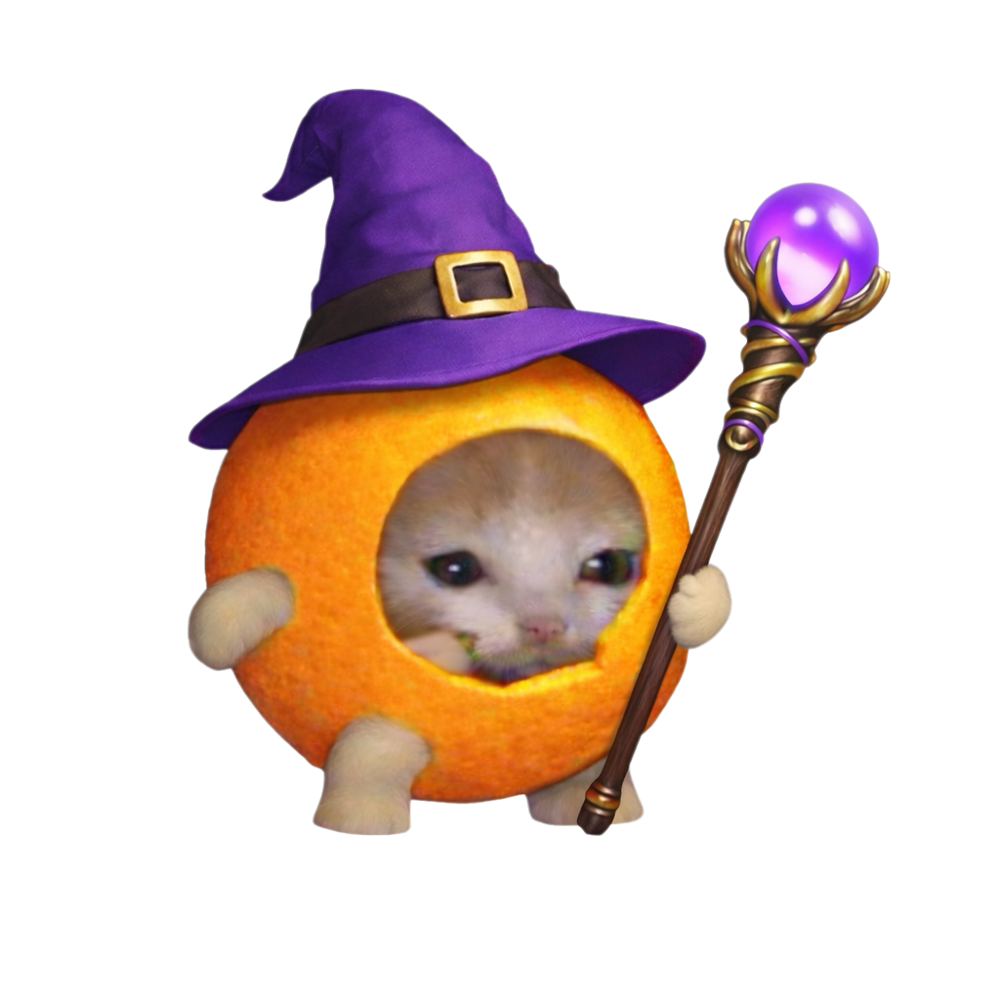
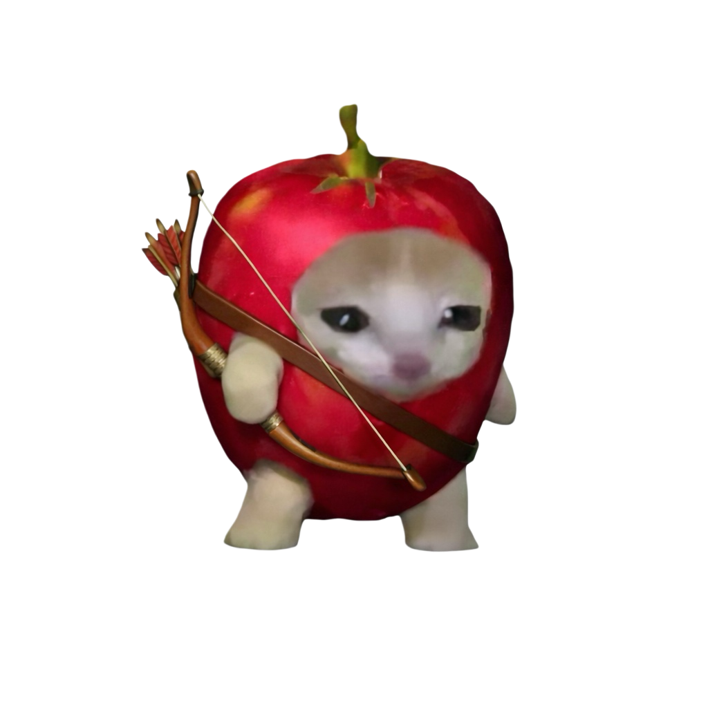
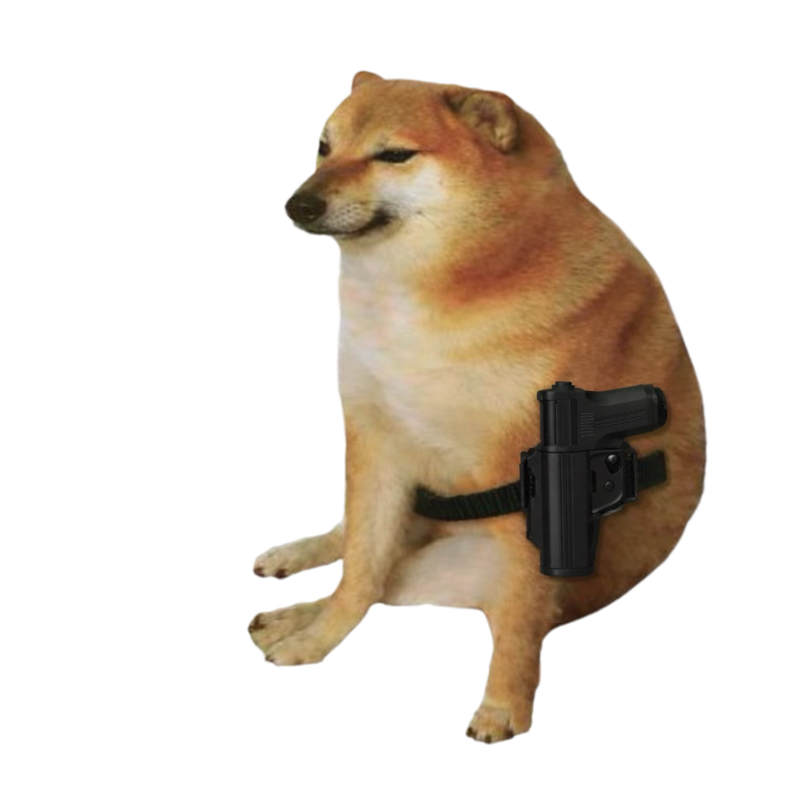

# Cheems Battle Game

A turn-based desktop battle game built with Python and Pygame. Choose two cat heroes, face two randomly selected dog enemies, and use attacks, defense, and character-specific special abilities to win.

<p align="center">
  
  
  
  &nbsp;&nbsp;⚔️&nbsp;&nbsp;
  
  
  
</p>
## Features

- Choose exactly two heroes before each battle
- Fight two randomly selected enemies
- Three actions: **Attack**, **Defend**, and **Special**
- Six characters with unique stats and special abilities
- Special-ability cooldown system
- Experience, leveling, and stat progression
- Character action animations, sound effects, background music, and a battle log
- Restart and select a new team after the battle

## Characters

| Team | Character | HP | ATK | DEF | Special ability |
|---|---|---:|---:|---:|---|
| Heroes | Orangecat | 100 | 25 | 8 | **Healing Magic** — restores 20 HP |
| Heroes | Applecat | 80 | 20 | 10 | **Fire Arrow** — deals 20% of the target's current HP |
| Heroes | Bananacat | 80 | 30 | 4 | **Overload** — deals 30 direct damage |
| Enemies | Drog | 80 | 30 | 6 | **Sonic Bark** — deals 20–40 random damage |
| Enemies | Cheems | 120 | 20 | 10 | **Assault Rifle** — deals 1.5× ATK damage |
| Enemies | Witchdog | 70 | 25 | 5 | **Recovery Magic** — restores 15 HP and adds 1 ATK |

Special abilities have a three-turn cooldown. Characters gain EXP by attacking and taking damage. Every 100 EXP increases the character's level, ATK, and DEF.

## Requirements

- Python 3.9 or later
- [Pygame](https://www.pygame.org/)

## Installation

Clone the repository:

```bash
git clone https://github.com/QYechang/Battlegame_cheems.git
cd Battlegame_cheems
```

Install Pygame:

```bash
python -m pip install pygame
```

Start the game from the repository root:

```bash
python template.py
```

On Windows, you may need to use `py` instead:

```powershell
py -m pip install pygame
py template.py
```

> Run the command from the repository root so the game can find the files in the `image/` and `sound/` folders.

## How to Play

1. Select two heroes on the character-selection screen.
2. Click **Start Battle**. Two enemies will be selected randomly.
3. During each hero's turn, choose one action:
   - **Attack** — damage a random living enemy.
   - **Defend** — reduce incoming damage by half.
   - **Special** — use the current character's unique ability if it is ready.
4. After both heroes act, the enemy team takes its turn.
5. Defeat both enemies before both heroes are defeated.
6. Click **Restart** after the battle to choose a new team.

## Project Structure

```text
Battlegame_cheems/
├── template.py       # Main game loop, screens, and battle flow
├── Character.py      # Characters, combat logic, skills, EXP, and levels
├── button.py         # Reusable Pygame button component
├── image/            # Character sprites, backgrounds, and UI icons
└── sound/            # Background music and sound effects
```

## Built With

- Python
- Pygame

## Author

Created by [Yechang Qi](https://github.com/QYechang).
